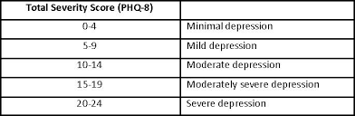
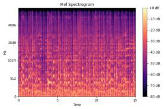

Welcome to this repo ! This contains the work of my Junior year project titled 

**"Real Time Speech Emotion Recognition using LSTM and Raspberry Pi"** 
Multimodal analysis using Machine learning and embedded systems is becoming largely useful in the early detection of many diseases( including metal health conditions).
I am extremely enthusiastic about this area and up for any useful discussions regarding the same!

**A little insight into the topic**

Early detection and treatment of depression is essential in promoting remission, preventing relapse, and reducing the emotional burden of the disease. Current diagnoses are primarily subjective, inconsistent across professionals, and expensive for individuals who may be in urgent need of help. This paper proposes an effective approach of feature extraction from speech signals of patients to diagnose fluctuations in emotions and mood of people. These observed repetitive emotion patterns are indicative of a patient’s mental health and helps in the treatment of depression. The acoustic feature used for analysis and decision-making in this work is the MFCC (Mel Frequency Cepstral Coefficient). A detailed spectral analysis of the audio files in the DAIC_WOZ database has been carried out using MATLAB to bring out the differences in spectral features of healthy versus depressed individuals. Further, a Long Short-Term Memory (LSTM) has been built with an accuracy score of **86%**, to predict the emotions from voices of different people using the RAVDESS dataset. Validation of the working of our machine learning model has been done using real time voice signals of people which have been collected and processed using Raspberry Pi 3 and this results in a similar accuracy score as the RAVDESS dataset. Hence, speech signal analysis using machine learning to predict depression in patients and a detailed spectral analysis makes the case for our proposed methodology

Commonly used voice quality measures in depression detection could be borrowed from signal-processing methodologies, such as jitter, shimmer, the small cycle-to-cycle variations in glottal pulse amplitude in voiced regions, 
harmonic-to-noise ratio, and the ratio of harmonics to in harmonic components.The correlations of laryngeal biomarkers with psychomotor retardation assessment resulted in improved understanding of the neurophysiological basis for changes in voice quality with depression and human speech degradation.

**Methodology**

Firstly, the DAIC WOZ database which has voice samples of people who have varied levels of depression ranging from very severe to very less has been utilised. These voice samples have been represented in MATLAB as spectrograms using which the fact that speech signals and acoustic features indeed differ greatly from depressed versus healthy individuals has been highlighted. Secondly, using the conclusions drawn from the first section we have developed a deep RNN model based on Long Short-Term Memory (LSTM) which uses the voice samples from the RAVDESS dataset. The result of this model shows that given any voice sample as the input, the model can recognise the emotion in the person’s voice using features like MFCC. The last section validates the model developed in the previous section by feeding real time voice samples instead of dataset voice samples which have been collected and processed using the Raspberry Pi 3 Model B.

**Traditional PHQ8 scoring vs spectrogram approach**

This is what a traditional PHQ8 score table looks like .

 

Spectrogram analysis provides a much better understanding of acoustic features like MFCC. What sets apart these features is that they cannot be manipulated or hidden according to the patient’s wishes. They provide a quantitative and qualitative measure of emotions in voice which the patient has no control over.

A spectrogram tells you how much energy (PSD) there is at a given frequency at a given time Frequency: Represents how many times per second an element producing sound vibrates. It has three axes, Frequency, Time and Power. Each sound, no matter how simple or complicated, can be split up into frequencies, just as a picture can be split up into pixels

 

**LSTM Model implemented to predict 7 emotions**

LSTM  stands for Long Short Term Memory which is a subcategory of Recurrent Neural Networks . This is beneficial becuase it has the capability to identify semantic reevence in a long sentence rather than just a small one.

LSTM has feedback connections, i.e., it can process the entire sequence of data, apart from single data points such as images. The LSTM model makes.
 use of gates to enable long term memory feature.

  

 **Rpi 3 to collect real time voice data as a test dataset for our model**

The Raspberry Pi is a series of credit card sized single-board computers. The main purpose of using Raspberry Pi 3 with a LM393 sound sensor module is to use the DSP Processor on an integrated level. 

The application of Raspberry Pi 3 in speech signal processing is to take the speech signal with a lot of redundancy and compress it to remove background noise before transmitting it. The setup has been interfaced using Python Libraries such as GPIO and RPi. This is further processed on MATLAB and then passed to the Machine Learning model where Python Librosa Library is used. The features captured in MATLAB are histogram, spectrogram, MFCC coefficient and the frequency and time domain axes plots. These have been plotted.

**Dataset information**

We have made use of 2 different datasets, one is the DAIC-WOZ database from the **University of Southern California** .
This can be obtained by filling an application at their webiste : https://dcapswoz.ict.usc.edu/

Participants were interviewed by Ellie, a virtual visitor, for a total of 189 interactions. The audio files and facial features of the participants in each session were recorded. The duration of each interaction ranged from 7 to 33 min (an average of 16 min). Before the conversation with Ellie, each respondent filled out a questionnaire about mental state (PHQ-8, Kroenke et al., 2008). The binary classification of depression and non-depression was carried out based on the PHQ-8 score, used as the labels for the respondents.

The second database used is the RAVDESS dataset: which contains 1440 files: 60 trials per actor x 24 actors = 1440. The RAVDESS contains 24 professional actors (12 female, 12 male), vocalizing two lexically matched statements in a neutral North American accent. Speech emotions include calm, happy, sad, angry, fearful, surprised, and disgusted expressions. Each expression is produced at two levels of emotional intensity (normal, strong), with an additional neutral expression.

**Preprocessing using MATLAB**

Here we demonstrate how spectrograms can be obtained from the DAIC dataset voice samples and the observations we have deduced from each of the different degrees of depression mentioned in Table I.The steps that were needed to obtain the MFCC from the audio dataset were Pre Emphasis(framing, windowing), Fast Fourier Transform,  Mel Filter Bank, Log(), DCT/IFFT, and Mel Cepstrum.MATLAB code was developed for the same. 

**ML Model development**

The spectral analysis of different emotions depicted by males and females in the RAVDESS dataset have been made. Later we pass the voice samples through the LSTM model which will accurately predict the emotion depicted in the voice. This model is also validated using real people’s voice samples collected and processed using Raspberry Pi 3. The spectrograms and Frequency and time domain plots are shown in the results file.

**The MATLAB code , LSTM model code and the results have been provoided in their repsective folders in this repository**

**This work has been puiblished as a research paper titled "Real Time Speech Emotion Recognition using LSTM and Raspberry Pi" in the The 7th International Conference on 'Computational Systems and Information Technology for Sustainable Solutions 2023 "**

The linkto the paper is here: 
 

