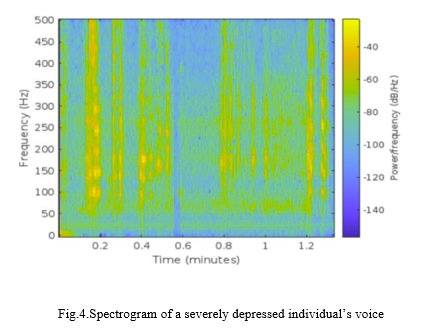
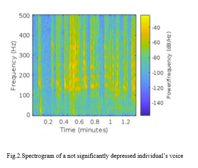
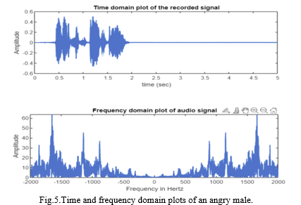
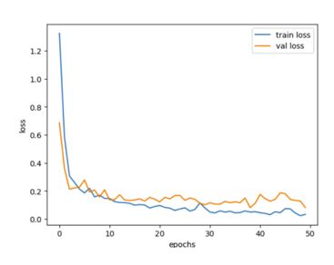
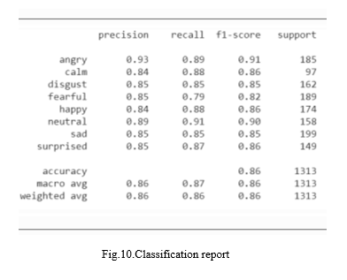

This file has the results of our project.

Here are the spetcrographical analysis of:

**severly depressed individual**

**not significantly depressed individual**

 

**Time and freq domain plots of females ands males with different emotions**

 

**Nueral layers in LSTM Model with 100 epochs**

**Loss curve**

**classification report**

