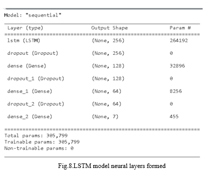

This file has the results of our project.

Here are the spetcrographical analysis of:

**Severly depressed individual**

**Not significantly depressed individual**

 

**Time and freq domain plots of females ands males with different emotions**

 

**Nueral layers in LSTM Model with 100 epochs**

**Loss curve**

**Classification report**

